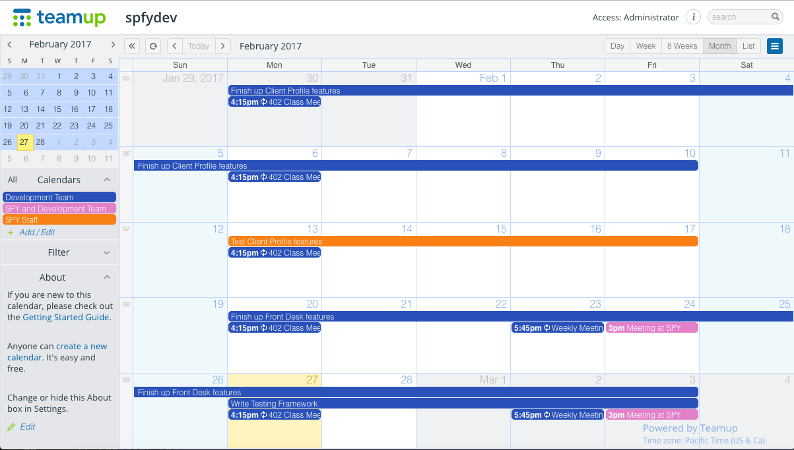
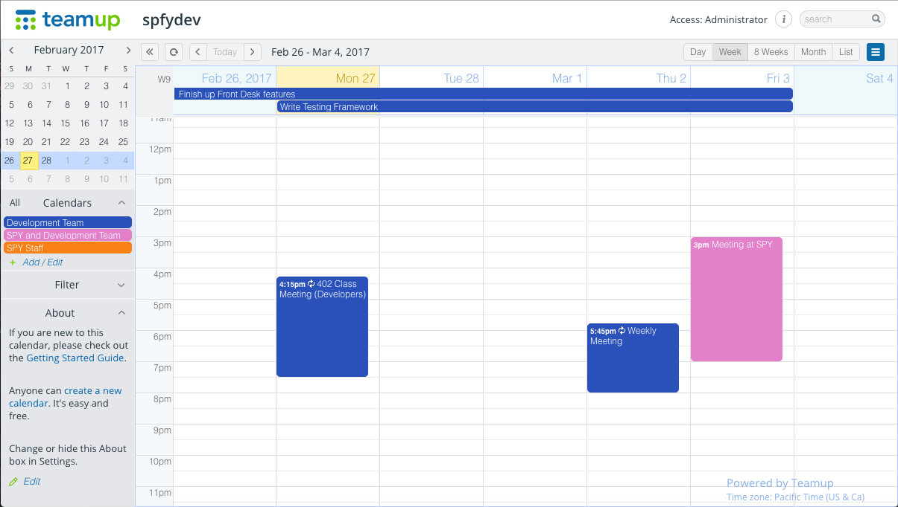
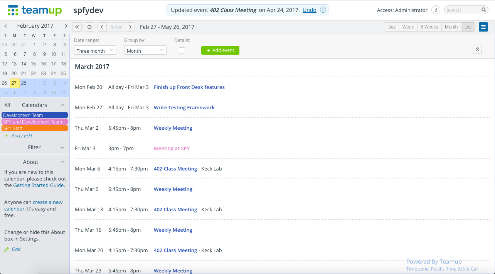

#4.0 Software Development Plan

##4.1 Plan Introduction

This section will layout the approach by which the development team will design and build the SPY Database system. Deliverables, Resources, Organization method, and Schedules will be described and/or illustrated.

###4.1.1 Project Deliverables

- _Beta - January 1st - May 6th - After meeting with SPY staff throughout the Fall to demonstrate alpha prototypes, we will continue to gradually release features to them throughout the Spring for testing purposes.
- _2.0 - Late May_ - We transfer ownership of the app over to SPY and take up a maintenance and additional features development role.

##4.2 Project Resources

###4.2.1 Hardware Resources

  Resource           | Development   | Execution
  ------------------ | ------------- | -----------
  Macbook Computer   | ✓             | ✓
  2008 or newer machine | ✓ | ✓
  2 GB RAM | ✓ | ✓
  16 GB Storage | ✓ | ✓
  screen | ✓ |
  Wifi connection | ✓ |
  Ethernet connection | ✓ | ✓
  Linux Computer       |               | ✓
  Intel or ARM processor | ✓ | ✓

###4.2.2 Software Resources

  Resource              | Development   | Execution
  --------------------- | ------------- | -----------
  Google Chrome         | ✓             | ✓
  Safari                | ✓             | ✓
  Firefox               | ✓             | ✓
  Sublime Text Editor   | ✓             |  
  Atom Text Editor      | ✓             |
  PostgreSQL            | ✓             | ✓
  Sequelize             | ✓             | ✓
  Node.js               | ✓             | ✓
  macOS                 | ✓             | ✓
  Windows OS            | ✓             | ✓
  Linux OS              | ✓             | ✓
  Heroku                | ✓             | ✓
  GitHub                | ✓             |
  Postico               | ✓             |
  Postman               | ✓             |

##4.3 Project Organization

###4.3.1 Organization Structure

The project demands integration between database, front end, and back end. However, rather than divide the team by section of the app, the app's features have been sectioned horizontally (that is, each team member assigned to implement a feature is responsible for the front end, backend, and database design of that feature end-to-end). In this manner, each team member gains full-stack development experience, the team can scale effectively while being sensitive to required work and member availability, and base implementations can be delivered for features much more quickly.

###4.3.2 Internal Interfaces

In order to make development for the application more ubiquitous and accessible, it is imperative that some of the custom tools the team uses for development, such as node js scripts, are cross-compatible with mainstream operating systems such as Windows, Linux, and Mac OSX. Therefore, the team will work to ensure that any code, frameworks, and/or packages are compatible in these different environments.

###4.3.3 External Interfaces

The team will communicate directly with SPY staff through any means necessary, whether it be email, text, or in-person. Meetings between the team and SPY staff will be documented on notes saved in cloud storage as well as audio recorded so the team has direct resources for investigating user needs.

###4.3.4 Roles and Responsibilities

Each week the development team meets 5:45 PM - 7:00 PM on Thursday evenings. Roles are defined by requirements, features, and components that are being implemented (see Section 5.0 Requirements Specification document). Team members' responsibilities will dynamically change based on which aspects of these features need to be worked on. Ideally, each team member will be working on at least one feature to have its minimum requirements implemented for testing. Currently, the project also has a database administrator who is responsible for developing the schema/model for the database as well as the SQL code to build the database. Two other developers are responsible for continuing to the build the API on the web server and the front end interface web pages.

##4.4 Project Schedule

###4.4.1 GANTT Chart

###4.4.2 Task / Resource Table

  Task                                               | People         | Hardware           | Software
  -------------------------------------------------- | -------------- | ------------------ | ----------------------------------------------
  New Drop In                                        | Volunteer Developer         | Macbook            | Node.js, Chrome, PostgreSQL, macOS, GitHub
  Edit Drop In                                       | Volunteer Developer        | Macbook            | Node.js, Chrome, PostgreSQL, macOS, GitHub
  List Drop Ins                                      | Volunteer Developer           | Macbook            | Nodejs, PostgreSQL, macOS, Chrome, GitHub
  Add Client                                         | Volunteer Developer        | Macbook            | Node.js, Chrome, PostgreSQL, macOS,GitHub
  View Client Profile                                | Volunteer Developer        | Macbook   | Node.js, GitHub, PostgreSQL, macOS,Chrome
  Search Client                                      | Volunteer Developer          | Macbook            | Node.js, Chrome, PostgreSQL, macOS, GitHub
  Look & Feel                                        | Volunteer Developer   | Macbook            | Node.js, Chrome, PostgreSQL, macOS, GitHub
  Client/Appointments/Drop-In Session Filter Table   | Volunteer Developer         | Macbook            | Node.js, Chrome, PostgreSQL, macOS, GitHub

###4.4.3 Class Schedule

-   [Week 01](http://myweb.lmu.edu/bjohnson/cmsi402web2/week01.html)

    -   Meet & greet

    -   Introduction and Syllabus

    -   Generic Production Process Steps

    -   Parts of the Software Engineering Process

-   [Week 02](http://myweb.lmu.edu/bjohnson/cmsi402web2/week02.html)

    -   No class - MLK day

-   [Week 03](http://myweb.lmu.edu/bjohnson/cmsi402web2/week03.html)

    -   Project proposal Presentations

-   [Week 04](http://myweb.lmu.edu/bjohnson/cmsi402web2/week04.html)

    -   Project proposal Presentations (continued . . .)

    -   Requirements

    -   Project Management

-   [Week 05](http://myweb.lmu.edu/bjohnson/cmsi402web2/week05.html)

    -   Project proposal Presentations (continued . . .)

    -   Brief Intro to UML

    -   Software Architecture: insights, basics, evolution, and design

-   [Week 06](http://myweb.lmu.edu/bjohnson/cmsi402web2/week06.html)

    -   Detailed Design and Modeling

    -   Design Reviews: Preliminary and Critical

    -   Coding for remainder of class

-   [Week 07](http://myweb.lmu.edu/bjohnson/cmsi402web2/week07.html)

    -   Development Process

    -   Testing, Test Plan, Test Procedure, CM Plan

    -   Software Horror Stories

    -   Coding for remainder of class

-   [Week 08](http://myweb.lmu.edu/bjohnson/cmsi402web2/week08.html)

    -   Coding for remainder of class

-   [Week 09](http://myweb.lmu.edu/bjohnson/cmsi402web2/week09.html)

    -   Spring Break

-   [Week 10](http://myweb.lmu.edu/bjohnson/cmsi402web2/week10.html)

    -   Deployment, metrics, maintenance

    -   Coding for remainder of class

-   [Week 11](http://myweb.lmu.edu/bjohnson/cmsi402web2/week11.html)

    -   Guest Speaker: LMU Alum John Zimmerman

    -   Coding for remainder of class

-   [Week 12](http://myweb.lmu.edu/bjohnson/cmsi402web2/week12.html)

    -   Coding for remainder of class

-   [Week 13](http://myweb.lmu.edu/bjohnson/cmsi402web2/week13.html)

    -   Design review presentations #1

-   [Week 14](http://myweb.lmu.edu/bjohnson/cmsi402web2/week14.html)

    -   Design review presentations #2

-   [Week 15](http://myweb.lmu.edu/bjohnson/cmsi402web2/week15.html)

    -   Design review presentations #3

-   [Week 16](http://myweb.lmu.edu/bjohnson/cmsi402web2/week16.html)

    -   Guest Speakers: Software Engineering Panel

-   [Week 17](http://myweb.lmu.edu/bjohnson/cmsi402web2/week17.html)

    -   Final Presentations / Demonstrations

## 4.5 User Manual

Installation and running instructions are on [README](../README.md)

Users will need to simply navigate to a url to access the website. The current url for the prototype of the system is http://spy-test.herokuapp.com/

Users can use their username and password credentials to login to the application on the top right of the any page on the web application.

After logging in, users can use the interface to navigate between webpages to view data related to check-in, enrollment, and client profiles.

Users can log out through the "Profile" link on the top right to end their session.
